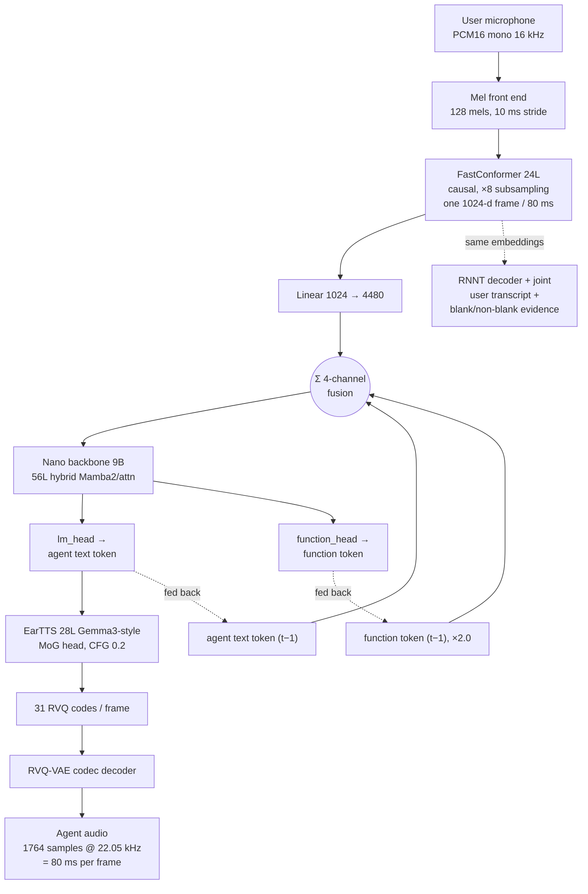
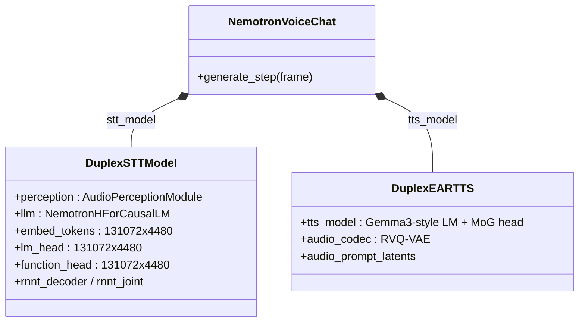
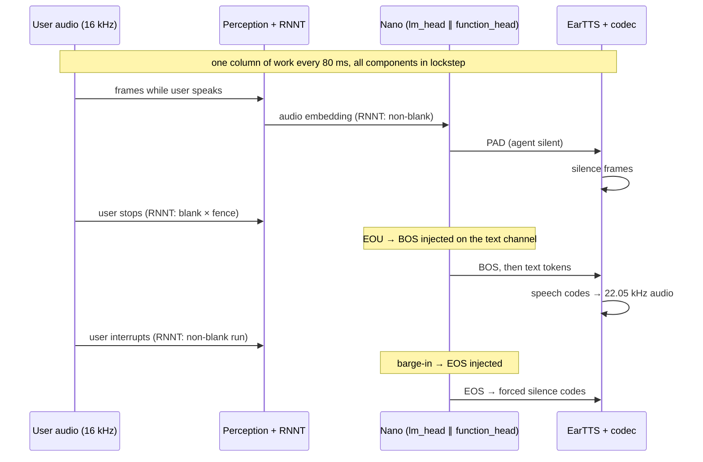
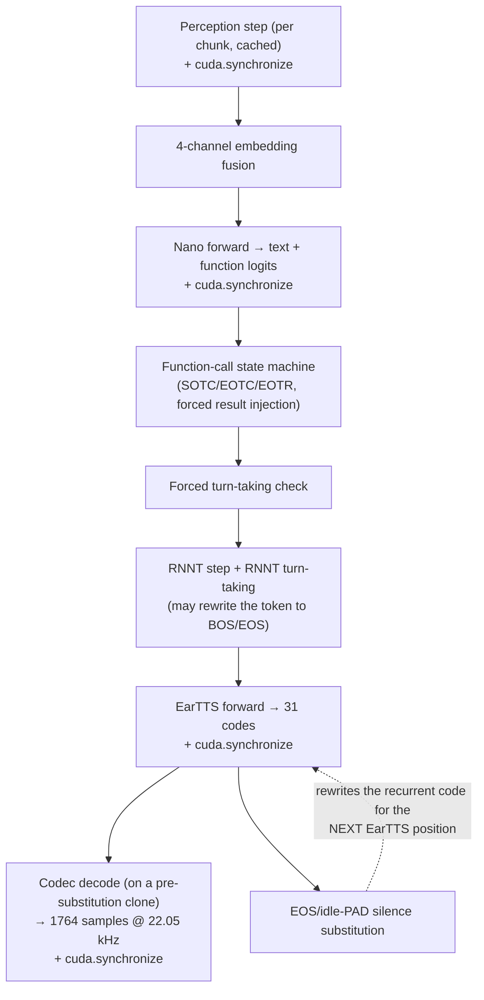
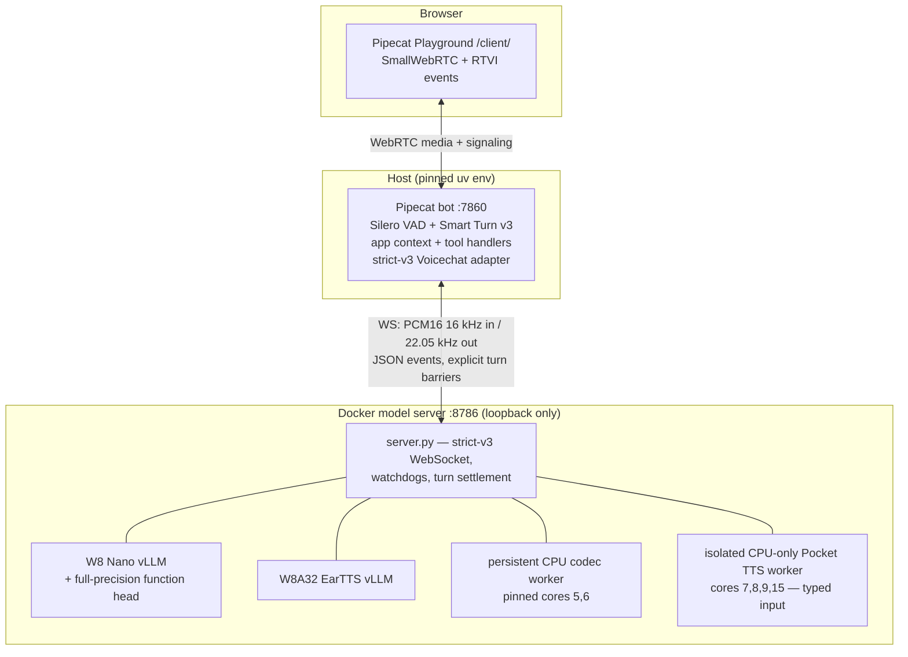
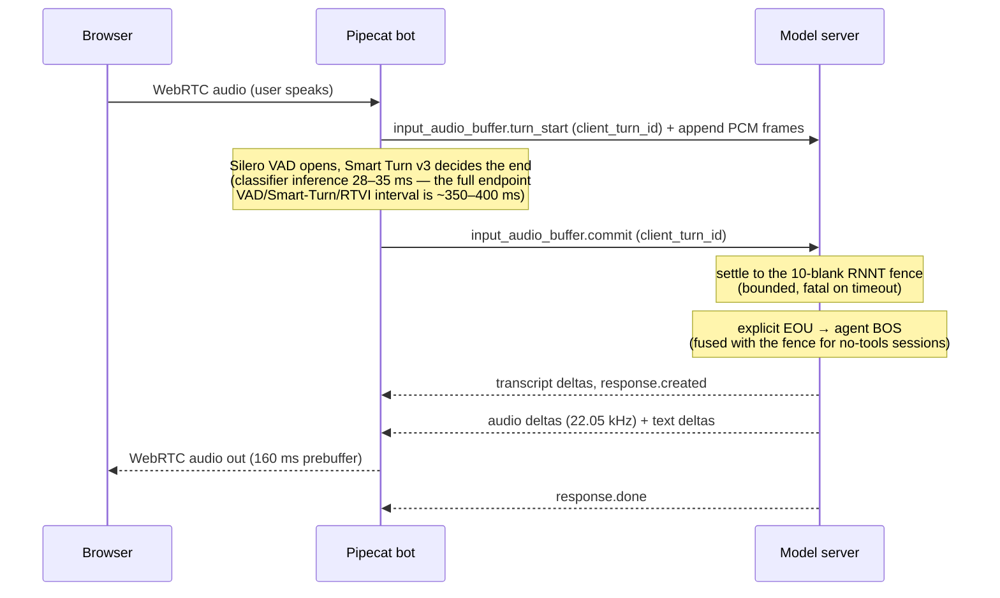
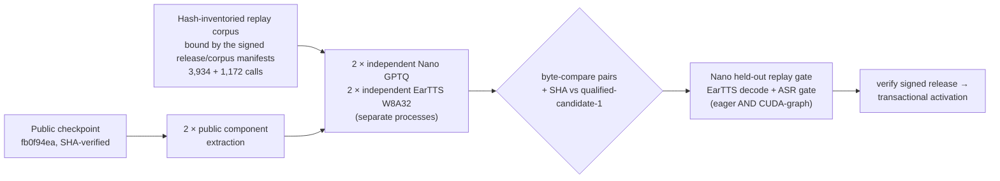

# NVIDIA NemotronLabs VoiceChat 11B on DGX Spark: Model Architecture and Realtime Runtime

This document explains, in one place, (1) how the NVIDIA NemotronLabs
VoiceChat 11B model works, and (2) what this repository changed to run it in
realtime on a single DGX Spark (GB10). It is written for ML/infra engineers.
Detailed protocol, latency, reproduction, and qualification records live in
the sibling docs; this is the synthesis.

> **Viewing in a browser:** open `model-and-runtime-overview.html` next to
> this file (serve the `docs/` directory, e.g. `python3 -m http.server`) to
> get rendered Markdown and Mermaid diagrams.

## 1. Introduction

[NVIDIA NemotronLabs VoiceChat 11B](https://huggingface.co/nvidia/NVIDIA-NemotronLabs-VoiceChat-11B)
is an end-to-end, speech-to-speech, **full-duplex** conversational model: it
listens and speaks simultaneously, decides for itself when to talk, and is
described by NVIDIA as the first open full-duplex model to support tool
calling. NVIDIA released it on
2026-08-03 as a research-oriented "Labs" checkpoint under OpenMDW-1.1:
11.095 B parameters, all FP32, a 44.4 GB single-file safetensors checkpoint.
NVIDIA's supported-hardware list is A100/H100/H200/B100/B200/RTX-6000 with an
80 GB VRAM minimum. **DGX Spark is not on that list.** Closing that gap is
this project.

The model's defining property is a hard realtime contract: **every 80 ms it
must consume one frame of user audio and produce one frame of agent audio.**
Each 80 ms frame requires three sequential neural-network forwards (perception
encoder, LLM backbone, speech decoder) plus an audio-codec decode. On Spark's
GB10, the stock FP32/BF16 checkpoint and NVIDIA's reference inference loop do
not fit inside that budget. To make them fit, this repository:

- **quantized** the LLM backbone (calibrated GPTQ W8) and the speech decoder
  (W8A32 with a custom Triton kernel), while deliberately keeping the
  tool-calling head at full precision;
- **patched vLLM** through hash-qualified, single-anchor source edits
  (Marlin kernel padding, dead-work removal, CUDA-graph capture contracts);
- **moved the audio codec to CPU**, pinned to two of GB10's Cortex-X925 big
  cores, pipelined one frame deep;
- **rebuilt the serving loop** around client-owned turn boundaries, eager
  session prefill, and a family of speech-decoder latency optimizations;
- **gated every change on qualification**: bitwise A/B replay, held-out logit
  agreement, and independent ASR scoring — and retired one headline
  optimization when qualification said so (§5.5).

## 2. The VoiceChat 11B model

### 2.1 Components and parameter budget

The checkpoint ships no `modeling_*.py`; the model code is the
`nemotron-labs-voicechat` branch of
[NVIDIA-NeMo/Speech](https://github.com/NVIDIA-NeMo/Speech) (pinned here at
`911ec674`). The top-level `NemotronVoiceChat` is two cooperating models:
`DuplexSTTModel` (perception + LLM + heads + RNNT) and `DuplexEARTTS`
(speech decoder + codec).

| Component | Params | What it is |
|---|---:|---|
| `stt_model.llm` — Nano backbone | 7,714 M | Nemotron-Nano-9B-v2 (`NemotronHForCausalLM`): hybrid Mamba2/attention/MLP, 56 layers of which only **4 are attention** (GQA, 40 query / 8 KV heads, head dim 128), hidden 4480, MLP intermediate 15680 (relu²), vocab 131,072 |
| `tts_model.tts_model` — EarTTS decoder | 797 M | Gemma3-text-style decoder-only LM: 28 layers, hidden 1152, MHA 16 heads (head dim 72), sliding-window attention with full attention every 6th layer (window 1500 as served); **mixture-of-Gaussians output head** (3 layers, low-rank 64, 1024 predictions) emitting a 31-codebook acoustic frame; classifier-free guidance scale 0.2; 3 s speaker-prompt latent ("Aria"); 1-layer T5Gemma text/context encoder |
| `stt_model.perception` | 614 M | FastConformer from `nvidia/nemotron-speech-streaming-en-0.6b`: 128-mel front end (25 ms window / 10 ms stride), 24 layers, d_model 1024, depthwise-striding ×8 subsampling, **fully causal** (attention context [70, 0] — zero right lookahead), then Linear 1024 → 4480 |
| `embed_tokens`, `lm_head`, `function_head` | 3 × 587 M | three 131,072 × 4480 matrices; the function head is initialized as a `deepcopy` of `lm_head` and trained as a separate output channel |
| `tts_model.audio_codec` | 200 M | custom RVQ-VAE: **31 quantizers × 1024 codes**, latent 512, 22.05 kHz, 1764 samples per token → 12.5 frames/s, 3.875 kbps |
| `stt_model.rnnt_decoder` + `rnnt_joint` | 9 M | RNNT prediction network (640-d, 2 LSTM layers) + joint over the **same** Conformer embeddings, with its own 1024-token SentencePiece vocabulary |
| **Total** | **11,095 M** | all FP32 in the shipped checkpoint |

One property worth flagging up front: the released checkpoint ships **one
fixed voice** and does not support voice cloning — the 3 s "Aria"
speaker-prompt latent is checkpoint/runtime state, not a user-selectable
interface.



Structurally (UML class view):



Two consequences of the Nano backbone being 52/56 Mamba2 layers matter for
everything downstream: Nano maintains substantial **recurrent Mamba state**
alongside the four attention layers' KV cache, so this serving implementation
must preserve a live stateful request rather than replaying stateless chat
completions (see §3), and per-token decode is memory-bandwidth-bound GEMV
work (so weight quantization pays off directly — see §4).

### 2.2 Full-duplex operation: the 80 ms frame contract

**80 ms is the universal clock.** Every rate in the model lands on exactly
12.5 frames/s:

- input: 10 ms mel stride × 8 subsampling = one encoder frame per 80 ms;
- backbone: one Nano position per 80 ms;
- output: one EarTTS frame = 31 codec codes = 1764 samples at 22.05 kHz
  = 80 ms of audio.

Per frame, **four channel embeddings are summed into one Nano input vector**
(`AddFusion`; configured weights text 1.0, user-audio 1.0, user-text 1.0,
function 2.0):

1. the **user audio** embedding — a fresh Conformer frame, ingested every
   frame regardless of whether the agent is speaking. This is what makes the
   model duplex: it always hears the microphone;
2. the **agent text** token it emitted last frame (fed back);
3. the **function channel** token it emitted last frame (fed back, weighted
   2.0);
4. a user-text channel, disabled in this checkpoint (RNNT is used instead).

One Nano forward then produces **two tokens from the same hidden state** —
the agent text token via `lm_head` and the function token via
`function_head`.

On the text channel the token protocol is (from the NeMo docstring):

```text
flow:         |---user---||-------assistant--------||-user-|
text channel:  0000000000  1xxxxxxx0000000000000002  000000
                 0=PAD        1=BOS   x=text   2=EOS
```

PAD (`<SPECIAL_12>`) has a dual meaning: "agent silent" *and* "agent still
speaking but its text is already emitted" (the audio tail lags the text).
That duality is why naive PAD-frame suppression chops audio, and why the
runtime's idle-PAD optimizations (§5.3) must distinguish the two cases.

Turn-taking is deliberately deterministic: production sampling is
temperature-zero argmax for every token. (The sampler also has a
special-token fast path — a raw argmax in {BOS, EOS, PAD, SOTC, EOTC, EOTR}
is returned directly, skipping top-p and penalties — but that distinction
only matters when non-greedy sampling is enabled.) Training over-weights the
boundary tokens (BOS 12.5×, EOS 7.5×, text 5×, PAD 1×).
Three mechanisms decide speak-vs-silent, in priority order:

1. **Natural prediction** — `lm_head` emits BOS to open a response, EOS to
   close it (optionally biased by PAD/BOS/EOS logit boosts, all 0.0 stock).
2. **RNNT turn-taking** — the embedded RNNT emits blank or non-blank per
   frame. N consecutive blanks → end-of-utterance → the pipeline *injects*
   agent BOS (stock reference config: 40 frames = 3.2 s; NVIDIA's Triton
   default: 15; this repo's legacy server-owned mode: 20). N consecutive
   non-blanks while the agent speaks → barge-in → injected EOS. The
   injection happens *after* Nano but *before* EarTTS reads the token, so
   the speech decoder sees the corrected token.
3. **Forced turn-taking fallback** — a PAD-window heuristic that forces BOS
   if the model has been silent too long after user speech.



### 2.3 Tool calling in a full-duplex model

Tool calling is a **separate synchronized token channel**, not a text-format
convention. The function head emits `<SPECIAL_20>` (SOTC, start of tool
call), then the call tokens — a
`<TOOLCALL>[{"name": ..., "arguments": ...}]</TOOLCALL>` payload — then
`<SPECIAL_21>` (EOTC). The pipeline executes the tool, then **force-injects
the result into the function channel one token per model position** as
`<TOOL_RESPONSE>...</TOOL_RESPONSE>`, terminated by `<SPECIAL_22>` (EOTR).
Throughout the cycle the text channel is forced to PAD, which is the
mechanism that prevents the model from speaking JSON.

The structural cost follows from the position count, not a wall clock: async
FC advances these hidden positions unpaced ("full LLM speed" in NVIDIA's
config), but on GB10 each position measured ~80.64 ms, so a 73-position tool
result took ~6.24 s (§5.6). NVIDIA
ships latency-hiding for this (async function-call mode that runs FC tokens
faster than realtime, randomized acknowledgement phrases, per-tool "on hold"
messages, a 15 s tool timeout, and a speech-duration interrupt that aborts an
in-flight call). Section 5.6 measures this cost on Spark and describes the
two accelerations this repo shipped on top.

### 2.4 NVIDIA's stock inference loop

The reference implementation (`nemotron_voicechat_inference_wrapper.py`,
`streaming_s2s_pipeline.py`) does the following per 80 ms position:



Three sequential model forwards, **four** explicit `cuda.synchronize()`
barriers (perception, Nano, EarTTS, codec decode), and a codec decode —
every 80 ms, forever. Note that stock silence substitution rewrites the
recurrent code fed to the *next* EarTTS position; the current frame's codec
input is cloned before substitution.

**Engines.** The default stock mode runs both Nano and EarTTS under vLLM
(`AsyncLLM`), driven in a highly non-standard way: custom input specs replace
token IDs with tensors (Nano receives the 4480-d bf16 `combined_embeds`
fusion; EarTTS receives acoustic-token/text-token/mask/BOS tensors and a
speaker latent), and custom outputs return logits and codes. Requests are
created with `temperature=0.0, ignore_eos=True, max_tokens=100000` — a
session is one never-terminating vLLM request per engine, stopped only by
explicit abort. NVIDIA maintains a vLLM fork for this
(`vklimkov-nvidia/vllm`, pinned `237ba3ca`, over native `b31e9326`).
`mamba_ssm_cache_dtype` is forced to float32.

**Precision and memory.** Stock single-GPU split: Nano bf16 at
`gpu_memory_utilization=0.52`, EarTTS **fp32** at 0.18 (NVIDIA's own config
notes bf16 EarTTS "causes hallucinations"), codec on GPU in fp32.

**Batch assumptions.** Strictly batch-1, single stream, stateful: the Triton
packaging disables batching (`max_batch_size: 0`) and routes a correlation
ID to a pinned stateful instance; the deploy docs state realtime streaming
only. The turn-taking and sampling code paths iterate Python-side per batch
element, and neither the wrapper nor the serving protocol serializes the
per-stream Mamba/KV state that migrating a request elsewhere would require.

### 2.5 The realtime budget on GB10

Everything in sections 4–5 is motivated by one table. On Spark, with the
quantized weights and the runtime below, the measured per-position costs
during turn-boundary settlement (six-position stage attribution,
`docs/voice-to-voice-latency.md`) are:

| Stage (per 80 ms position) | Measured |
|---|---:|
| Perception | ~11.8 ms |
| Nano interface (dominated by vLLM model execution) | ~31 ms |
| EarTTS | ~16 ms |
| Codec (CPU, one-frame pipelined) | ~7.5 ms |
| **Sum vs budget** | **~66 ms vs 80 ms** |

The margin is real but thin: sustained `server_step_ms` in production soaks
runs at mean ~68–70 ms with p95 ~72–74 ms against the 80 ms fence, and any
frame over budget becomes queue debt that delays every subsequent frame
(the server may not skip audio). GB10-specific realities that shaped the
solution: unified LPDDR5X memory shared between CPU and GPU (bandwidth, not
FLOPs, is the constraint for batch-1 GEMV decode — hence weight
quantization); an ARM64 PyTorch build whose depthwise-Conv1d fallback made
the codec pathologically slow on GPU-adjacent paths (hence the CPU codec
worker, §5.2); and a big/little CPU (codec and Pocket TTS workers pin to
disjoint Cortex-X925 big cores).

## 3. System architecture of this repository



The division of authority is the design's core decision: **the model server
owns continuous acoustic/model state; Pipecat owns turn boundaries.** The
model is single-session, batch-1, and stateful (§2.4), so the server never
replays context as a stateless chat completion — it mirrors context outward
for the application instead. Pipecat's Silero VAD opens a turn and local
Smart Turn v3 closes it, sending explicit, correlated
`turn_start`/`commit` barriers over the strict-v3 protocol
(`docs/protocol-v3.md`). The server advertises
`input_turn_detection: "client_smart_turn_v1"`; the model's own RNNT-driven
EOU (§2.2) is retained only as a diagnostic mode. RNNT remains the
transcript/evidence source in production.

Points worth knowing at this level (details in the protocol doc):

- `session.updated` is a **model-ready barrier**: the real session prompt is
  prefilled *before* the acknowledgement is sent (§5.4), and Pipecat admits
  microphone media only after it.
- A commit is authoritative even if RNNT decoded nothing: it requests
  exactly one model EOU/BOS transition, settled through a bounded blank
  fence (§5.1).
- **Typed input** goes through the same audio path as the microphone: a
  prewarmed, process-isolated, CPU-only Pocket TTS worker synthesizes the
  text to PCM (deterministically seeded per text), which is injected through
  perception/RNNT without wall-clock pacing and closed with the same
  explicit EOU as a microphone commit. Direct token injection was tried and
  rejected on evidence: in a frozen A/B against an acoustic carrier, voice
  input reached the start-of-tool-call token as argmax (margin +0.94) while
  direct text injection never selected it (margin −2.94) — the released
  checkpoint is distribution-shifted for that interface.
- Function results flow upstream immediately (the model cannot finish its
  response without them), under a transactional applied-acknowledgement,
  bounded recovery (256 model ticks), and a circuit breaker of 8 calls per
  response.
- Watchdogs guard every acoustic liveness assumption: an agent-silence EOS
  watchdog, an acoustic response boundary (turns close on decoded silence,
  reversible before text EOS), a session position limit, and bounded
  settle/ack deadlines — all fail closed.

One committed microphone turn, end to end:



## 4. Making it fit: quantization for GB10

The conversion recipe is frozen in `config/conversion-recipe.json`; the only
accepted source is the public checkpoint
`nvidia/NVIDIA-NemotronLabs-VoiceChat-11B @ fb0f94ea`. Converted weights are
published at an immutable revision in
[`pipecat-ai/NVIDIA-NemotronLabs-VoiceChat-11B-Spark`](https://huggingface.co/pipecat-ai/NVIDIA-NemotronLabs-VoiceChat-11B-Spark),
so normal installs download rather than convert.

### 4.1 Nano: calibrated GPTQ W8 (group 128) + Marlin

The 9B backbone is quantized with classic symmetric GPTQ — 8-bit, group
size 128, static groups, deterministic column order, damp 0.01,
Cholesky-inverse Hessian — over **105 selected tensors**: the MLP up/down
projections, the Mamba in/out projections, and `lm_head`. Activations stay
bf16 (W8A16 effectively), served through vLLM's Marlin GPTQ kernels.

What deliberately **stays full precision**: the **function head** (tool
calling is the model's most fragile capability and the head is a single
587 M GEMV), both embedding matrices, and all attention q/k/v/o projections
(only 4 of 56 layers — not worth the risk).

Calibration uses **captured fused-embedding replay tensors, not text**: the
Nano input is a 4480-d fused embedding (§2.2), so the converter replays
3,934 recorded Nano calls from three calibration conversations and evaluates
on a physically separate 1,172-call conversation. The corpus contains no
microphone recordings; prompts were authored for this project and every
include/reject decision is recorded.

One vLLM patch makes this fast on the real shapes:
`patch_voicechat_marlin_g128_padding.py`. The Mamba `down_proj` has
K = 15680, which is not a multiple of the 128 group size, so Marlin's
group-128 8-bit kernel cannot allocate it. The converter zero-pads that
weight tail to K = 15744, and the patch — keyed narrowly to exactly this
shape — allocates the Marlin kernel at the padded K and zero-pads the
activations to match. Arithmetically identical, and it unlocks the fast
kernel for the whole Mamba/MLP stack.

**Gate:** the held-out replay passed all 1,172 calls with token agreement
1.0, minimum logit cosine 0.998677, control-token order agreement 1.0, and a
maximum BOS/PAD margin delta of 0.3125.

### 4.2 EarTTS: W8A32 with a custom Triton kernel

EarTTS is quantized to symmetric per-output-channel INT8 **weights with FP32
activations** (205 tensors: backbone attention + MLP, and the MoG head's MLP
stack; norms, embeddings, RVQ tables, and the codec stay FP32). The
activation precision is not negotiable: NVIDIA's own config requires fp32
EarTTS because bf16 hallucinates, and the recurrent mixture-of-Gaussians
sampler is the precision-sensitive part.

No stock vLLM path does INT8-weight/FP32-activation, so the repo ships one:
`ea_w8a32.py`, a Triton kernel that loads INT8 weights, promotes and
accumulates in FP32, and applies per-channel scales — registered as a vLLM
quantization method and wrapped in a `torch.library` custom op so it is
CUDA-graph- and compile-safe. (The `ea_` prefix is a serialized ABI
identifier for the loader, not a checkpoint-lineage marker.)

**Gate:** the standalone EarTTS component gate produced the exact reference
transcription (WER 0.0 under an independently hashed evaluator) in **both**
eager and CUDA-graph modes.

### 4.3 Deterministic reproduction as a design requirement

The conversion pipeline treats reproducibility as part of correctness. One
command (`./voicechat bootstrap --convert-from-source`) runs the entire flow
and refuses any deviation:



Two independent conversions of each component must be byte-identical to each
other *and* hash-identical to the published Production Candidate 1 before
the gates even run; activation is transactional with automatic rollback.
This was verified end-to-end from the public checkpoint on a DGX Spark on
2026-08-05. Details: `docs/weight-reproduction.md`.

## 5. Making it realtime: runtime engineering

### 5.1 The serving loop

`src/nemotron_voicechat_runtime/server.py` wraps NVIDIA's pipeline in a
FastAPI/WebSocket server with a hard frame model: 1280 samples per frame,
`budget_ms = 80`, and per-frame metrics that flag `over_budget` explicitly.
All model work funnels through a **one-worker executor** — strict
serialization is a feature, since the model is stateful and reentrancy would
corrupt it.

The input path per frame: the PCM frame buffer feeds a **transport speech
gate** (leading-silence frames below threshold never touch the model — they
emit idle steps and accumulate in a bounded preroll buffer), and when the
gate opens, an **onset-suffix selector** replays only the frames from just
before first speech rather than the whole buffer (measured: 12 buffered →
4 replayed; the four replayed positions took 290.485 ms). In the combined
eager-start/onset run, first-turn voice-to-voice improved from 2260.8 to
1461.3 ms — a cross-run delta, not an isolated selector saving.

The turn boundary is a settlement contract. When Pipecat commits a turn, the
server advances the model through bounded zero-input positions until the
RNNT reaches **10 consecutive blank frames** (`nonblank_reset_after_silence`
— the same fence NVIDIA's pipeline uses before clearing RNNT phrase state),
then issues the explicit EOU that opens the agent response. Live isolation
showed why the fence cannot be shortened for latency: forcing BOS at 0 or 5
blanks produced formally valid but empty responses. (This 10-blank
*settlement* fence is distinct from `VOICECHAT_RNNT_EOU_FRAMES = 20`, the
threshold for the legacy server-owned RNNT turn detection that production
does not use.) For sessions that advertise **no tools**, the final fence
position is fused with the agent BOS, removing one ~180–200 ms serial model
position; tool sessions keep the legacy two-step path because the
function-call guard must observe every settlement position.

An honestly open issue: WebSocket ingestion and model consumption share one
serial task, so a commit can queue behind already-sent audio the model
hasn't consumed (the root-caused source of a historical 2.7 s TTFB —
measured 108 packets ≈ 2160 ms of backlog on one turn). Separating ingestion
from consumption behind a bounded ordered queue is remediation item 2 in
`docs/voice-to-voice-latency.md` and is not yet implemented.

### 5.2 CPU codec offload

On GB10's ARM64 PyTorch build, the codec's grouped/depthwise Conv1d path was
pathologically slow — the offload module's documented rationale is a fallback
to thousands of scalar grouped-convolution calls (no profiler trace is
retained for that count). The fix
(`cpu_codec_offload.py`, `cpu_codec_worker.py`) moves the RVQ-VAE decoder
into a **persistent subprocess pinned to two Cortex-X925 big cores (5, 6)**,
with exact-math layer rewrites: `SlicedDepthwiseConv1d` re-expresses each
depthwise conv as vectorized slice-multiply-accumulate (hard-fails unless
exactly 18 convs are replaced), and pointwise 1×1 convs route through the
linear path (exactly 38). The worker is prewarmed with the codec silence
tokens before the server reports ready, and decode is **one-frame
pipelined**: the call for frame F submits F and waits on F−1, hiding codec
latency behind the next GPU step. Only token tensors cross the process
boundary; CUDA never enters the worker.

Measured contribution: ~7.5 ms per settlement position and 0.4 ms at BOS —
the stage attribution explicitly rules the codec out as a remaining
bottleneck.

### 5.3 The EarTTS latency family

A set of independently qualified optimizations
(`runtime_optimizations.py`), all opt-in by env flag, all fail-closed:

- **Idle-PAD bypass.** On ordinary idle PAD positions (agent silent, not in
  a PAD-tail), skip the entire EarTTS forward and emit qualified cloned
  decoder-silence codes while preserving recurrent code/cache identity. In
  the qualifying trace, 439 positions were bypassed at zero EarTTS cost;
  this removed EarTTS's entire 96.8 ms share of turn settlement.
- **Exact-constants hoisting.** Precompute the padded RVQ embedding buffer
  (promoted) — a second stage caching gate/norm constants was measured as a
  regression and **excluded**. Every hoisted value is verified bitwise
  (`torch.equal` on byte views) against recomputation, with
  device/dtype-transition invalidation hooks.
- **Reset-on-BOS + prepared speaker epoch.** Opening a response forces an
  EarTTS abort-and-prefill speaker reset (measured 73–78 ms, originally
  133 ms) on the latency-critical BOS position. The prepared-epoch
  controller performs that reset at microphone `turn_start` — while the user
  is still speaking — and arms it only after the commit has flushed all PCM.
  A BOS may consume it only if every bound identity still matches exactly:
  the logical request, the physical backend request ID and generation, the
  RequestState object, the iterator, the generated-token count, the
  speaker/prompt/initial-code fingerprints, the session and prepare epochs,
  and the committed client turn; any mismatch falls back to
  the byte-equivalent legacy reset. The boundary invariant is versioned:
  Δtransition = 1 = Δreset + Δreuse, accepting exactly (1,1,0) or (1,0,1).
- Supporting pieces: vLLM delta-output (stop re-copying cumulative output
  per step), a cyclic-GC guard for the lifetime of a realtime stream, and a
  BF16 perception override applied before graph capture.

### 5.4 Startup: 383 s → ~250 s, and session eagerness

Cold start was attributed additively (`reports/step9-cold-start-20260807.md`);
the largest contributors:
Nano vLLM engine init 154 s, EarTTS engine init 119 s, NeMo CPU structure
init 41 s, pipeline setup ~47 s, warmup 10 s (smaller hydration, startup, and
health-poll phases make up the rest of the full 382.9 s to Playground-ready).
The promoted fix is an **image-baked, keyed, fully inventoried vLLM compile
cache** plus a **capture contract**: fixed CUDA-graph capture-size lists for
Nano and EarTTS, and a patched dispatcher
(`patch_step9_capture_contract.py`) under which any uncovered graph
descriptor after readiness falls back to graphless execution with a logged
counter in production and a hard error in qualification — and any
post-ready `torch.compile` is release-blocking. Result: **247.954 s /
254.087 s** ready (−33.6–35.2%). Measured and *not* promoted: exact-prompt
warmup (260.0 s — no saving).

At session level, **eager start** runs the real session's prompt prefill
before `session.updated` is acknowledged, moving a measured 4.19 s off the
first speech turn; combined with onset-suffix preroll, first-turn browser
voice-to-voice fell from 2260.8 to 1461.3 ms.

### 5.5 What didn't survive: conditional two-frame PAD drafting

The repo's most instructive engineering story is an optimization that
worked, passed a bitwise gate — and was then retired on its own evidence.

**Mechanism.** In a duplex conversation most frames are PAD-on-PAD (user
talking or silence, agent silent). The PAD-pair path exploited that: on a
draft-eligible frame, buffer the fused embedding and return a synthetic PAD
*without touching Nano*; next frame, pack both positions into one
two-position vLLM request — effectively one-token speculative decoding where
the draft is always PAD, halving Nano calls in idle stretches. Because 52/56
Nano layers are Mamba, rejection needs real state rollback: each Mamba layer
kept shadow conv/SSM snapshots taken after position 0 and restored them if
the target model rejected the drafted PAD. "Conditional" meant drafting only
when the previous effective token was already PAD; a "control barrier"
predicted forced BOS/EOS from pre-step RNNT counters and dropped to
sequential stepping so a pair could never straddle a turn boundary. A
companion patch (`patch_pair_full_graph.py`) gave the pair its own FULL CUDA
graph: vLLM keys graphs on `(num_tokens, uniform_decode)`, so the
1-request/2-token pair collided with the 2-request/1-token decode graph and
fell to eager execution; the patch added `query_len` to the descriptor and
captured the initialized-continuation branch, including the rollback
shadows. Its best bug is a one-liner to remember: *CUDA graph replay updates
tensor shadows but cannot replay a Python attribute assignment* — the
rollback pointer had to be rebound outside the graph. The bitwise gate
passed 1,389/1,389 calls.

**Retirement** (commit `d4a7e0a`). Production traces caught one packed
two-position call that never returned — and a wedged vLLM/CUDA request
cannot be cancelled and resumed transactionally, so a timeout-and-retry
would risk duplicating or corrupting recurrent state. A second, stochastic
weakness had already been documented: after some function-call cycles the
function channel failed to return to PAD, disabling drafting for a measured
510-frame stretch (mean Nano 82.7 ms, implied queue debt peaking at 2.98 s).
A preregistered preflight then asked whether the optimization was still
necessary — and it wasn't:

| `server_step_ms` | PAD-pair baseline | Sequential Nano |
|---|---:|---:|
| mean | 68.24 | 71.13 |
| p95 | 84.77 | **73.98** |
| p99 | 94.79 | **84.64** |

At a hard 80 ms cadence, tail latency is what creates queue debt; retiring
the path was a net win. Production now enforces the retirement: a policy
validator refuses to boot if any PAD-pair flag (or its CUDA graph) is
re-enabled. The implementation is retained for offline diagnosis, and none
of the evidence was deleted.

### 5.6 Tool-call latency

A preregistered benchmark (`docs/tool-call-latency-benchmark.md`, harness in
`tools/benchmark/`) measured the full cost of one tool call at a
representative 72-token result: **≈ 11.2 s from SOTC to first audible
post-tool speech** — 2.32 s of autoregressive call emission (27 positions),
<0.02 s of actual tool, 2.08 s of unconditional "on hold" speech, 6.24 s of
forced result injection (73 positions), 0.56 s to first audible PCM. The
result phase fits `355.9 ms + 80.64 ms × positions` (R² 0.9992), and
child-process calibration showed 99% of Nano interface time is vLLM model
execution (~60.7 ms/position) — scheduling and plumbing are exonerated;
NVIDIA's pinned implementation has the same serial architecture. Two fixes
shipped on the current branch:

1. **Fast-tool grace** (`VOICECHAT_FC_FAST_TOOL_GRACE_MS`): start the tool
   immediately and render the on-hold utterance only if the result is still
   pending after the grace window. For fast tools, result-available → result
   injection p95 fell from ~2 s to **0.957 ms** in the step-one
   qualification (10.30 ms p95 on the final step-two image; both far inside
   the unchanged 250 ms gate); slow tools keep the acknowledgement path.
2. **Client-authored `model_output`** (protocol capability
   `function_output_model_output`): the application keeps the full
   structured tool result in its own history but supplies a concise
   model-facing sentence; the runtime injects only that (~20 tokens, exactly
   21 positions regardless of full-result size) and never derives one from
   the other. Result-injection time fell from 6.24 s to **1.76 s mean** at
   72 tokens.

In the post-fix browser smoke, a warm non-tool voice turn in a
tool-advertised session measured 1.387 s voice-to-voice (TTFB 0.587 s) — a
session-health sample, not an end-to-end tool-cycle latency. Planned next
(not yet implemented): EarTTS bypass on hidden
forced-result positions, batched teacher-forced injection, and
target-verified speculative call emission. Known open items: the on-hold
reminder audio is rendered but never reaches the client (tracked as a
transport defect), and chained tool calls remain unreliable and
non-promotable (content degrades by call 3; whether the cause is
prompt/turn-history handling or checkpoint capability is unresolved).

### 5.7 Current measured latency budget

Browser-measured voice-to-voice latency (last speech above −40 dBFS at the
microphone to first speech above −40 dBFS from the remote track, one clock):

| Milestone (immutable runtime image) | Voice-to-voice | Pipecat TTFB |
|---|---:|---:|
| Cold session, pre-remediation (worst retained) | 8971.2 ms | 8239.6 ms |
| Warm pre-remediation | 4021.3 ms | 3263.8 ms |
| Stage-attribution baseline (`2e71bf28…`) | 1470.7 ms | 732.3 ms |
| Eager start + onset preroll (`523b0387…`) | 1461.3 ms | 709.6 ms |
| Idle-PAD EarTTS bypass (`c7308768…`) | 1360.0 / 1322.5 ms | 632.6 / 550.8 ms |
| Prepared epoch, via ngrok HTTPS (`97f6f9d2…`) | 1343.5 ms | 552.2 ms |

Each row is a point sample from a different immutable image and run.
Differences between rows are **not** isolated causal savings (the source doc
attributes a 128.7 ms warm-turn difference to run variance and declines to
credit the ~75 ms prepared-reset saving from one sample), and none of these
figures are percentile/SLA distributions.

The additive warm-turn budget (turn 2 of the qualified run):

```mermaid
gantt
    dateFormat  x
    axisFormat  %Q
    title One warm turn, browser last-speech → first-speech (ms)
    section Browser
    VAD + Smart Turn + RTVI (~378 ms)      : 0, 378
    section Pipecat→Server
    commit send → handler read (48 ms)     : 378, 426
    section Model server
    settle to 10-blank RNNT fence (430 ms) : 426, 856
    EOU/BOS + first bytes (181 ms)         : 856, 1037
    generated leading silence (248 ms)     : 1037, 1285
    section Delivery
    server PCM → browser audio (~123 ms)   : 1285, 1408
```



Under the current qualified boundary and output contracts, the residual
cannot be removed by parameter tuning alone: the 10-blank fence is
a qualified correctness contract (§5.1), the model itself generates ~250 ms
of leading silence (three frames) after BOS, and endpointing costs what VAD
plus Smart Turn cost. A 400 ms voice-to-voice target would require a
redesigned boundary/onset path — e.g. settlement overlapped with the
endpointing window with rollback semantics — and full requalification; the
latency doc records this as the standing conclusion.

## 6. Qualification: why any of this is trustworthy

Running a quantized research checkpoint through a patched inference stack
invites silent semantic damage. The repo's defense is uniform and worth
stating once:

- **Hash-qualified patches.** Every vLLM/NeMo modification asserts the
  SHA-256 of the pinned source file, requires its anchor to appear exactly
  once, verifies with `py_compile`, and refuses otherwise. The full
  installed tree is classified file-by-file (966 files: 922 byte-identical
  to pinned public sources, 36 patched, 8 added) with escrowed deltas.
- **Bitwise and semantic gates.** Optimizations qualify against bitwise A/B
  replay where exactness is claimed (e.g. 1,389/1,389 for the pair graph,
  `torch.equal` for hoisted constants), and against semantic gates where it
  is not: the held-out Nano replay (1,172/1,172, logit cosine ≥ 0.9987), WER
  gates on input transcripts, and response scoring by an **independent
  Nemotron English ASR judge** running in its own audited container.
- **Immutable evidence.** Every promoted runtime-performance claim is bound
  to a named immutable image digest and retained traces; architecture and
  stock-code claims in this document are bound to the frozen checkpoint
  configs and pinned Git revisions listed in §7.3.
- **Negative results are kept.** A GEMV rewrite retired for a p99
  regression; a constants cache excluded; exact-prompt warmup measured as
  useless; direct text injection rejected on logit-margin evidence; a
  10-session live campaign recorded as "failed honestly"; the ASR judge's
  own first calibration preserved red; and the PAD-pair retirement of §5.5.
  The qualification style is preregistered criteria, fail-closed defaults,
  and refusal to launder point samples into distributions.

Full treatment: `docs/qualification.md`, `docs/provenance.md`,
`docs/public-build-graph.md`.

## 7. Appendix

### 7.1 Glossary

| Term | Meaning |
|---|---|
| **frame / position** | one 80 ms model step: one user-audio frame in, one agent token pair + one audio frame out (12.5/s) |
| **PAD** | `<SPECIAL_12>`; channel-inactive token — agent silent, or speaking with text already emitted (PAD tail) |
| **BOS / EOS** | `<s>` / `</s>` on the agent text channel: response opens / closes |
| **EOU** | end of user utterance; production issues it explicitly at commit after settlement |
| **blank fence / settlement** | advancing the model through bounded zero-input positions until the RNNT reports 10 consecutive blanks; required before a safe EOU |
| **SOTC / EOTC / EOTR** | `<SPECIAL_20/21/22>`: start / end of tool call, end of tool response, on the function channel |
| **fused embedding** | the per-frame sum of agent-text, user-audio, user-text, and function channel embeddings — Nano's actual input |
| **PAD pair** | retired two-position speculative Nano request drafting PAD (§5.5) |
| **FULL graph** | vLLM CUDA-graph mode capturing the entire model call for a fixed descriptor |
| **W8A32** | INT8 weights, FP32 activations (EarTTS) |
| **MoG head** | EarTTS's mixture-of-Gaussians output layer over 31 RVQ codebooks |
| **strict-v3** | the only supported model-server wire protocol (`docs/protocol-v3.md`) |
| **prepared epoch** | EarTTS speaker reset performed at `turn_start` and reused at BOS only under an exact match of every bound identity (request, backend request/generation, iterator, token count, fingerprints, epochs, committed turn) |
| **onset preroll** | replaying only the last pre-speech frames of the gate buffer when the speech gate opens |
| **Smart Turn** | Pipecat's local end-of-turn classifier (v3; classifier inference 28–35 ms — the full endpoint/VAD/RTVI interval is much larger), the production endpoint authority |

### 7.2 Mechanism → file map

| Mechanism | Where |
|---|---|
| Realtime server, protocol, settlement, watchdogs | `src/nemotron_voicechat_runtime/server.py`, `protocol.py` |
| Opt-in runtime optimizations (EarTTS family, GC guard, PAD-pair engine) | `src/nemotron_voicechat_runtime/runtime_optimizations.py` |
| Marlin g128 padding | `patch_voicechat_marlin_g128_padding.py` |
| Skip duplicate text-logits GEMV | `patch_public_skip_custom_text_logits.py` |
| PAD-pair scheduler + Mamba rollback (retired) | `patch_public_pad_pair_scheduler.py` |
| Pair FULL CUDA graph (retired) | `patch_pair_full_graph.py`, `patch_pair_full_graph_hotfix1.py` |
| EarTTS exact constants | `patch_eartts_exact_constants.py` |
| Startup capture contract + baked-cache guard | `patch_step9_capture_contract.py`, `step9_cache_guard.py` |
| W8A32 kernel + BF16 head dispatch | `ea_w8a32.py`, `ea_bf16_head.py`, `patch_ea_w8a32.py` |
| CPU codec worker | `cpu_codec_offload.py`, `cpu_codec_worker.py` |
| Typed-input Pocket TTS bridge | `pocket_worker.py`, `pocket_controller.py`, `pocket_ipc.py` |
| RNNT turn-taking / FC lifecycle Speech patch | `src/nemotron_voicechat_runtime/patches/nemotron-voicechat-rnnt-turn-taking.patch` |
| Quantization pipeline | `tools/conversion/convert_nano_marlin_gptq.py`, `nano_gptq_calibration.py`, `convert_eartts_w8a32.py` |
| Tool-call latency harness | `tools/benchmark/tool_call_latency_benchmark.py` |
| Pipecat service and demo bot | `src/nemotron_voicechat_pipecat/llm.py`, `demo.py` |

### 7.3 Frozen identities

| Artifact | Identity |
|---|---|
| Source checkpoint | `nvidia/NVIDIA-NemotronLabs-VoiceChat-11B @ fb0f94eaf4d03ddc430f39565229393fa1b50c26` |
| Published Spark weights | `pipecat-ai/NVIDIA-NemotronLabs-VoiceChat-11B-Spark @ a20c68547d27421c1e66bd501bf295569a0cc309` |
| NeMo Speech | `NVIDIA-NeMo/Speech @ 911ec674ab40f04302ef33672be4179f45a7310f` |
| vLLM (native) | `vllm-project/vllm @ b31e9326a7d9394aab8c767f8ebe225c65594b60` |
| vLLM (VoiceChat fork) | `vklimkov-nvidia/vllm @ 237ba3cafc14d514551539ad980f17d40d273dfa` |
| Signed weight release | `1d8c3db8efbb87e0da3be86f1045957018082e1e8a339edaaf7e9bf4fb70671b` |

### 7.4 Further reading

`docs/architecture.md` (component sketch),
`docs/protocol-v3.md` (wire contract),
`docs/voice-to-voice-latency.md` (measurement + remediation record),
`docs/weight-reproduction.md` (conversion),
`docs/qualification.md` (gates),
`docs/nano-step-stall-fix-plan.md` (PAD-pair retirement),
`docs/tool-call-latency-fix-plan.md` (tool-call work),
`docs/known-limitations.md` (upstream model limits).
